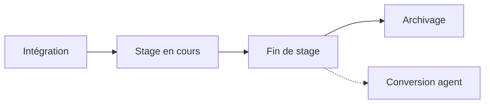

# Module Stage — MVP & Version complète

> Gestion du cycle de vie du stagiaire, de l'intégration à l'archivage du dossier.  
> Documents liés : [`integration.md`](./integration.md) · [`architecture.md`](./architecture.md) · [`guide-test-integration.md`](./guide-test-integration.md)

---

## Contexte

Le projet dispose déjà des briques suivantes :

| Élément existant | Usage stage |
|---|---|
| `TypeIntegration` (plusieurs types de stage) | Point d'entrée du dossier |
| `DossierIntegration` + `StatutDossier` | Workflow d'intégration |
| `Contrat` type STG | Convention de stage |
| `Fonction` « Stagiaire » | Nomination |
| `Agent` | Fiche personne |
| `HistoriqueIntegration` | Traçabilité |

Le module stage **réutilise l'intégration existante** pour l'entrée, puis ajoute une couche métier dédiée au suivi et à la clôture.



---

## Décisions métier de référence

| Question | MVP | Version complète |
|---|---|---|
| Matricule | `STG-YYYY-XXXXXX` | `STG-YYYY-XXXXXX` (ou ARTF si recruté ensuite) |
| Validation DG | Non | Paramétrable par type / durée |
| Compte utilisateur | Non | Restreint ou absent (paramétrable) |
| Gratification | Champ `remuneration` du contrat | Idem + règles par type de stage |
| Point d'entrée | Dossier d'intégration direct | Dossier d'intégration direct |
| Types de stage | Plusieurs `TypeIntegration` stage | Idem, documents paramétrables par type |

---

## Types de stage

L'ARTF accueille **plusieurs types de stage**, chacun modélisé par un `TypeIntegration` dédié (même circuit d'intégration, règles et pièces configurables) :

| Type | Description | Public concerné |
|---|---|---|
| **Stage académique** | Stage d'application ou de fin d'études | Étudiants (établissement d'enseignement) |
| **Stage professionnel** | Stage en milieu professionnel | Stagiaires non statutaires |
| **Stage de qualification** | Mise en stage après concours professionnel | Lauréats de concours |

Le type est porté par le `DossierIntegration` (`type_integration_id`) et recopié sur `ConventionStage.type_stage` à l'intégration.

---

## Documents d'entrée — communs à tous les types

Pièces **très fréquemment** exigées pour tout dossier de stage :

| Document | Rôle |
|---|---|
| **Demande de stage adressée au Directeur Général** | Lettre formelle de candidature / sollicitation |
| **Lettre de recommandation de l'établissement** | Aval de l'école, université ou organisme d'origine |
| **Curriculum Vitae (CV)** | Parcours et compétences du candidat |

> La présence de la demande adressée au DG est une **pièce du dossier**, distincte de l'étape workflow « validation DG » (paramétrable par type).

### Documents complémentaires (selon type)

| Type | Pièces additionnelles |
|---|---|
| Stage académique | Convention de stage (tripartite), certificat de scolarité, attestation d'inscription |
| Stage professionnel | Convention de stage |
| Stage de qualification | Convention de stage, décision / acte de mise en stage |

Ces listes sont paramétrables via `TypeIntegration.documents_obligatoires` (référence `TypeDocument`).

# MVP — Livrable intégrable

**Objectif** : couvrir l'essentiel du cycle (entrée → suivi → clôture) en s'appuyant à ~80 % sur le module d'intégration existant.  
**Estimation** : 2–3 jours.

### Principe

Le dossier d'intégration est le point d'entrée unique. Le **type de stage** est choisi à la création du dossier (`TypeIntegration` : académique, professionnel ou qualification).

### Périmètre (3 blocs)

#### 1. Entrée — via `DossierIntegration` existant

- Types : `Stage académique` · `Stage professionnel` · `Stage de qualification` (`TypeIntegration`)
- Workflow identique aux autres intégrations, **allégé par configuration** sur `TypeIntegration` :
  - `necessite_validation_dg = false` (par défaut ; paramétrable par type)
  - pas de compte utilisateur
  - matricule préfixe `STG-`
- **Documents obligatoires communs** (tous types) :
  - Demande de stage adressée au Directeur Général
  - Lettre de recommandation de l'établissement
  - Curriculum Vitae (CV)
- **Documents complémentaires** selon le type (voir section « Documents d'entrée »)
- À l'état `INTEGRE` : création automatique d'une `ConventionStage` (avec `type_stage`)
- `Agent.statut` → `stagiaire` (nouveau statut à ajouter)

#### 2. Suivi — entité `ConventionStage`

Champs minimum :

| Champ | Type | Description |
|---|---|---|
| `agent_id` | FK | Stagiaire intégré |
| `contrat_id` | FK | Convention STG active |
| `dossier_integration_id` | FK | Dossier source |
| `type_stage` | enum | `academique` · `professionnel` · `qualification` |
| `etablissement` | string | École / université d'origine |
| `tuteur_interne_id` | FK User/Agent | Maître de stage interne |
| `date_debut` | date | Début effectif |
| `date_fin` | date | Fin prévue |
| `statut` | enum | `EN_COURS` · `TERMINE` · `ROMPU` |

Actions :

- Consultation / liste des stages en cours (filtres : **type**, statut, service, période)
- Prolongation : mise à jour `date_fin` + upload avenant (document)
- Job planifié : alerte J-15 avant `date_fin` (tuteur + RH)

#### 3. Clôture — `ClotureStageService`

- Saisie évaluation finale : note + appréciation (formulaire unique)
- Génération attestation de stage (PDF DomPDF)
- Automatismes à la clôture :
  1. `Contrat` → `resilie`
  2. `Nomination` stagiaire → `cloturee`
  3. `Affectation` → `terminee`
  4. `Agent.statut` → `inactif`
  5. `ConventionStage.statut` → `TERMINE`

### Extension `TypeIntegration` (MVP)

```php
necessite_validation_dg: bool       // false par défaut ; paramétrable par type
necessite_compte_utilisateur: bool  // false pour stage
prefixe_matricule: string          // 'STG'
documents_obligatoires: json        // IDs TypeDocument — communs + spécifiques au type
```

### Modèle de données MVP

```
ConventionStage
├── agent_id, contrat_id, dossier_integration_id
├── type_stage (academique | professionnel | qualification)
├── etablissement, tuteur_interne_id
├── date_debut, date_fin
├── statut_stage (EN_COURS | TERMINE | ROMPU)
├── note_finale, appreciation (nullable, remplis à la clôture)
└── timestamps
```

### Architecture (ordre de création)

```
Migration conventions_stage + extension type_integrations + statut agent
→ Seeders : TypeIntegration (3 types stage) + TypeDocument (pièces stage)
→ Model ConventionStage
→ ConventionStageInterface → ConventionStageRepository → binding
→ ConventionStageService, ClotureStageService
→ FormRequests, ConventionStageResource
→ ConventionStageController
→ Routes sous /integration/stages
→ Job ConventionStageEnFinDateJob
→ Template PDF attestation-stage.blade.php
→ Hook dans DossierIntegrationService::integrer() → création ConventionStage
```

### Endpoints MVP

```
GET    /integration/stages                    # liste (filtres : type, statut, service, période)
GET    /integration/stages/{id}                 # détail + agent + contrat
PATCH  /integration/stages/{id}/prolonger       # nouvelle date_fin + document avenant
POST   /integration/stages/{id}/cloturer        # évaluation + clôture administrative
GET    /integration/stages/{id}/attestation     # PDF attestation de stage
```

### Permissions MVP

```
consulter-stages
gerer-stage              # prolongation (RH, tuteur)
cloturer-stage           # RH uniquement
```

### Hors MVP (reporté en version complète)

- Évaluation mi-parcours
- Archivage GED / verrouillage dossier
- Conversion automatique en agent permanent
- Compte utilisateur stagiaire
- Suspension / abandon avec workflow dédié
- Restitution matériel automatisée

### Checklist de validation MVP

- [ ] Dossier stage intégré → `ConventionStage` créée avec le bon `type_stage`
- [ ] Documents communs présents (demande DG, recommandation établissement, CV)
- [ ] Matricule `STG-YYYY-XXXXXX` assigné
- [ ] Alerte J-15 déclenchée
- [ ] Clôture résilie contrat, clôture nomination, agent `inactif`
- [ ] PDF attestation généré
- [ ] Aucune injection Repository dans Controller
- [ ] Tests Feature : entrée → suivi → clôture

---

# Version complète

**Objectif** : cycle de vie intégral, de l'intégration à l'archivage du dossier numérique.  
**Estimation** : 6–10 jours (après MVP).

### Vue d'ensemble — 4 phases

| Phase | Entité principale | Statuts clés |
|---|---|---|
| A — Intégration | `DossierIntegration` | Circuit existant, configurable par `TypeIntegration` |
| B — Suivi | `ConventionStage` | EN_COURS → PROLONGE \| SUSPENDU → TERMINE \| ROMPU \| ABANDONNE |
| C — Clôture | `EvaluationStage` + documents | TERMINE_PREVU → EVALUATION → PV_CLOTURE → ATTESTATION → CLOTURE |
| D — Archivage | GED (Module 12) | ARCHIVE (lecture seule) |

---

### Phase A — Intégration (workflow configurable)

Réutilise `DossierIntegration` avec règles stage sur `TypeIntegration` (un enregistrement par type : académique, professionnel, qualification) :

| Étape agent classique | Comportement stage |
|---|---|
| Validation DG | Paramétrable (`necessite_validation_dg`) — indépendant de la pièce « demande au DG » |
| Matricule | Préfixe `STG` ou `ARTF` selon config |
| Compte utilisateur | Optionnel, accès restreint |
| Salaire / grille | Gratification sur convention uniquement |
| Nomination | Fonction « Stagiaire » (automatique) |
| Documents | Liste paramétrable par `TypeIntegration` |

**Documents obligatoires — communs à tous les types** :

- Demande de stage adressée au Directeur Général
- Lettre de recommandation de l'établissement
- Curriculum Vitae (CV)

**Documents complémentaires** (selon type, voir section « Documents d'entrée ») :

- Convention de stage (tripartite ou bilatérale selon cas)
- Certificat de scolarité, attestation d'inscription (stage académique)
- Décision / acte de mise en stage (stage de qualification)
- Assurance responsabilité civile, fiche de renseignements stagiaire (si requis par le type)

**Transitions** (filtrées selon type) :

```
BROUILLON → SOUMIS → EN_ETUDE_RH → DOSSIER_COMPLET → VALIDE_RH
  → [EN_ATTENTE_DG] → VALIDE_DG → ACTE_GENERE → CONTRAT_SIGNE
  → MATRICULE_CREE → AFFECTE → NOMME → [COMPTE_CREE] → PRISE_DE_SERVICE → INTEGRE
```

À `INTEGRE` : création `ConventionStage` + `Agent.statut = stagiaire`.

---

### Phase B — Stage en cours (suivi opérationnel)

**Entité `ConventionStage` enrichie** :

| Champ | Description |
|---|---|
| `type_stage` | académique · professionnel · qualification |
| `etablissement`, `filiere`, `niveau_etude` | Origine académique |
| `tuteur_interne_id` | Maître de stage ARTF |
| `tuteur_externe_nom`, `tuteur_externe_email` | Référent établissement |
| `date_debut`, `date_fin`, `date_fin_reelle` | Période effective |
| `gratification` | Montant convention |
| `statut_stage` | EN_COURS · PROLONGE · SUSPENDU · TERMINE · ROMPU · ABANDONNE |
| `motif_suspension`, `motif_cloture` | Traçabilité |

**Fonctionnalités** :

| Besoin | Mécanisme |
|---|---|
| Suivi période | Alertes J-30, J-15, J-7 |
| Assiduité | Module absences (filtré stagiaires) |
| Évaluation mi-parcours | `EvaluationStage` type `mi_parcours` |
| Prolongation | `prolonger()` + avenant convention |
| Suspension | `suspendre(motif, dates)` |
| Abandon | `abandonner(motif)` |

**Entité `EvaluationStage`** :

| Champ | Description |
|---|---|
| `convention_stage_id` | FK |
| `type` | `mi_parcours` \| `finale` |
| `evaluateur_id` | Tuteur / chef de service |
| `note`, `appreciation`, `recommandation` | Contenu évaluation |
| `date_evaluation` | Date de saisie |

---

### Phase C — Fin de stage (clôture administrative)

**Déclencheurs** : date de fin atteinte, rupture anticipée, abandon.

**Workflow** :

```
TERMINE_PREVU → EVALUATION_SAISIE → PV_CLOTURE → ATTESTATION_GENEREE → CLOTURE
```

**Documents produits** :

- Procès-verbal de fin de stage
- Attestation de stage (PDF auto)
- Rapport de stage (upload stagiaire, optionnel)
- Avenant ou mainlevée (rupture anticipée)

**Automatismes à la clôture** :

1. `Contrat` → `resilie` / `termine`
2. `Nomination` → `cloturee`
3. `Affectation` → `terminee`
4. `Agent.statut` → `inactif` ou `archive`
5. Compte utilisateur → `desactiver` (si créé)
6. Restitution matériel via `RemiseMateriel` (sens inverse)

**Conversion post-stage** (optionnelle) :

Nouveau `DossierIntegration` type « Recrutement externe » ou « Contractuel », fiche `Agent` réutilisée, historique conservé.

---

### Phase D — Archivage du dossier

S'appuie sur le Module 12 — GED RH.

**Contenu archivé** :

- Dossier d'intégration + historique
- Demande au DG, lettre de recommandation, CV
- Convention + avenants
- Évaluations et PV de clôture
- Attestation de stage
- Correspondances (acceptation, fin)

**Règles** :

- `ConventionStage.archived_at` renseigné
- Dossier en lecture seule après archivage
- Durée de conservation paramétrable (ex. 5 ans)
- Recherche par nom, période, service, établissement

---

### Modèle de données complet

```
ConventionStage
├── agent_id, contrat_id, dossier_integration_id
├── type_stage (academique | professionnel | qualification)
├── etablissement, filiere, niveau_etude
├── tuteur_interne_id, tuteur_externe_nom, tuteur_externe_email
├── date_debut, date_fin, date_fin_reelle
├── gratification, statut_stage, motif_cloture
├── archived_at
└── evaluations (hasMany EvaluationStage)

EvaluationStage
├── convention_stage_id, type, evaluateur_id
├── note, appreciation, recommandation, date_evaluation

AttestationStage (ou document GED typé)
├── convention_stage_id, numero, fichier_path, genere_le
```

**Extension `TypeIntegration`** :

```php
necessite_validation_dg: bool
necessite_matricule_permanent: bool
necessite_compte_utilisateur: bool
prefixe_matricule: string          // 'STG' | 'ARTF'
documents_obligatoires: json        // IDs TypeDocument
duree_max_mois: int|null            // null = illimité
```

**Extension `Agent.statut`** :

```
actif | inactif | suspendu | retraite | stagiaire | archive
```

---

### Services (version complète)

| Service | Responsabilité |
|---|---|
| `DossierIntegrationService` | Inchangé + branchement type stage |
| `ConventionStageService` | Suivi, prolongation, suspension, alertes |
| `EvaluationStageService` | Évaluations mi-parcours et finale |
| `ClotureStageService` | Fin de stage, résiliation, désactivation compte |
| `AttestationStageService` | Génération PDF attestation |
| `ArchivageStageService` | Verrouillage, délégation `GedService` |

Chaîne respectée : `Controller → Service → Interface → Repository → Model`.

---

### Endpoints version complète

```
# Conventions / suivi
GET    /integration/stages
GET    /integration/stages/{id}
PATCH  /integration/stages/{id}/prolonger
POST   /integration/stages/{id}/suspendre
POST   /integration/stages/{id}/abandonner
POST   /integration/stages/{id}/evaluations          # mi-parcours ou finale
GET    /integration/stages/{id}/evaluations

# Clôture & archivage
POST   /integration/stages/{id}/cloturer
GET    /integration/stages/{id}/attestation
GET    /integration/stages/{id}/pv-cloture
POST   /integration/stages/{id}/archiver
POST   /integration/stages/{id}/convertir-agent      # déclenche nouveau dossier intégration
```

---

### Permissions version complète

```
consulter-stages
gerer-convention-stage
evaluer-stagiaire
cloturer-stage
archiver-dossier-stage
convertir-stagiaire-agent
```

---

### Jobs planifiés

| Job | Fréquence | Action |
|---|---|---|
| `ConventionStageEnFinDateJob` | Quotidien 08:00 | Alertes J-30, J-15, J-7 |
| `ConventionStageClotureAutoJob` | Quotidien | Passage `TERMINE_PREVU` si date dépassée (optionnel) |

---

### Plan de livraison

| Livrable | Contenu | Dépendances | Durée estimée |
|---|---|---|---|
| **L1 — MVP** | Entrée allégée, `ConventionStage`, clôture, attestation PDF | Module intégration | 2–3 j |
| **L2 — Suivi enrichi** | Évaluations, suspension, prolongation avancée | L1 | 2 j |
| **L3 — Clôture complète** | PV, restitution matériel, conversion agent | L2 | 2 j |
| **L4 — Archivage** | GED, verrouillage, recherche historique | L3 + Module 12 | 2 j |

---

### Différences stagiaire vs agent permanent

| Critère | Agent permanent | Stagiaire |
|---|---|---|
| Type intégration | Recrutement / Contractuel | Stage académique · professionnel · qualification |
| Acte | Décision / contrat CDI-CDD | Convention de stage |
| Matricule | `ARTF-YYYY-XXXXXX` | `STG-YYYY-XXXXXX` |
| Rémunération | Grille salariale | Gratification convention |
| Compte | Complet | Restreint ou absent |
| Validation DG | Systématique | Paramétrable |
| Fin de vie | Départ / retraite | Clôture stage + archivage |
| Carrière | Promotions, évaluations annuelles | Évaluations stage ponctuelles |

---

*Dernière mise à jour : Juin 2026*
