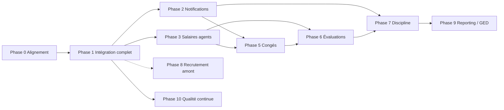

# Plan complet — Gestion RH API (ARTF)

> Dernière mise à jour : 2026-08-08  
> Références : [`suivi_projet.md`](./suivi_projet.md) · [`integration.md`](./integration.md) · [`SPEC-GRILLE-SALARIALE.md`](./SPEC-GRILLE-SALARIALE.md) · [`architecture.md`](./architecture.md) · [`structuration_par_module.md`](./structuration_par_module.md)

**État de départ :** socle + référentiels + module intégration (~85–90 %) + grille barème.  
**Objectif :** API RH opérationnelle de bout en bout, architecture inchangée (Controller → Service → Interface → Repository).

**Contrainte frontend :** tout ce qui est déjà livré côté API est **déjà consommé par le frontend**. Toute évolution backend doit préserver (ou versionner) le contrat existant ; les correctifs / ajouts se font en **extension**, pas en rupture.

---

## Principes directeurs

1. **Stabiliser avant d’élargir** — finir intégration + salaires agents avant congés / évaluations.
2. **Transversal tôt** — notifications + permissions dès que le flux métier est stable.
3. **Un module = une livraison testable** — guide de test + seeders + permissions.
4. **Doc synchronisée** — `suivi_projet.md` et `instruction_projet.md` mis à jour à chaque phase.
5. **Compatibilité frontend d’abord** — ne pas casser les écrans déjà branchés (voir section dédiée).

---

## Contrainte — Frontend déjà branché

Le frontend consomme déjà les endpoints et formes de réponse des modules livrés (auth, référentiels, structure org., intégration, grille barème). L’implémentation des phases suivantes doit respecter les règles suivantes.

### Périmètre déjà consommé (ne pas casser)

| Domaine | Endpoints / contrats à préserver |
|---|---|
| Auth & admin | `login`, `logout`, `user`, users / rôles / permissions |
| Structure org. | CRUD localités → bureaux + `byParent` |
| Référentiels | diplômes, grades, catégories, échelons, fonctions, types… |
| Intégration | `/api/integration/*` (agents, dossiers, transitions, documents, circuit, actes, contrats, affectations, nominations, comptes, matériel, prises de service, stages) |
| Grille | `grille-classes`, `grille-parametres`, `salaires`, `salaires/generation` |
| Formes JSON | enveloppes `{ data, message }`, champs Resources, enums de statut, query params de filtres |

### Règles d’évolution API

| Autorisé (non-breaking) | Interdit sans coordination frontend |
|---|---|
| Ajouter un endpoint | Renommer / supprimer une route |
| Ajouter un champ optionnel dans une Resource | Renommer / supprimer / changer le type d’un champ existant |
| Assouplir une règle métier (ex. accepter un statut en plus) | Durcir une règle qui faisait déjà réussir un appel FE (ex. nouveau champ obligatoire, nouveau 403) |
| Nouveaux query params optionnels | Changer le sens d’un enum / statut déjà affiché |
| Nouveaux modules sous de nouveaux préfixes | Réordonner / retirer des clés attendues dans `taches_post_integration` sans migration FE |

### Permissions & auth

- Les routes actuellement accessibles avec le seul `auth:sanctum` **ne doivent pas** recevoir de `permission:` bloquant sans mise à jour **simultanée** des rôles seedés **et** du frontend (gestion des 403).
- Préférer : permissions en **soft launch** (seed + middleware sur nouvelles routes seulement), puis durcissement coordonné.

### Processus de livraison

1. **Avant** toute modif sur un endpoint existant : identifier l’écran FE impacté (guides de test + parcours connus).
2. **Préférer l’extension** : nouveau endpoint / nouveau champ plutôt que modification destructive.
3. Si breaking change inévitable : documenter dans le PR (`BREAKING`), synchroniser le FE dans la **même livraison**, mettre à jour le guide de test.
4. Après merge API : smoke test du parcours FE déjà en prod/dev (intégration permanente + stage + grille).

### Impacts par phase (rappel)

| Phase | Impact FE | Conduite |
|---|---|---|
| 0 Alignement | Doc seule | Aucun |
| 1.A Workflow | Moyen | Assouplir sans retirer le chemin FE actuel ; **reportable** si on ne touche pas aux actes tout de suite |
| 1.B PDF / génération documents | Faible | **Reporté** — nouveaux endpoints plus tard, sans impact FE actuel |
| 1.C Permissions | **Élevé** | Coordonner FE + seeders ; ne pas activer en dur seul |
| 1.D Stage L2/L3 | Faible | Nouveaux endpoints |
| 2 Notifications | Faible | Nouveau module + éventuellement badges FE plus tard |
| 3 Salaires agents | Moyen | Nouveaux endpoints ; grille existante inchangée (sauf ajouts) |
| 5+ Nouveaux modules | Faible au départ | FE à construire en parallèle ou après |

---

## Phase 0 — Alignement (0,5–1 j)

| # | Action | Livrable |
|---|---|---|
| 0.1 | Mettre à jour `suivi_projet.md` (modules 1–3 + intégration = ✅ partiel / ✅) | Suivi fiable |
| 0.2 | Corriger `instruction_projet.md` (chiffres + statut réel) | Doc IA cohérente |
| 0.3 | Merger `new_fonction` → `develop` si pertinent | Une seule branche de travail |
| 0.4 | Checklist manuelle du happy path (recrutement externe + contractuel + stage) | Bugs connus listés |
| 0.5 | Inventaire contrat API ↔ écrans FE déjà livrés | Liste des endpoints / champs « gelés » |

---

## Phase 1 — Finaliser le module Intégration (priorité 1)

**Objectif :** parcours production-ready, conforme à `integration.md` (hors SMS), **sans régression frontend**.

### 1.A — Cohérence du workflow (1–2 j)

> **Contrainte FE :** le frontend suit déjà un parcours (guides + écrans). On **étend** les règles (ex. autoriser la génération d’acte aussi depuis `INTEGRE`) plutôt que d’interdire un chemin déjà utilisé.

| # | Tâche | Détail |
|---|---|---|
| 1.1 | Aligner **génération d’acte** avec post-intégration | **Assouplir** : accepter `VALIDE_DG` **et** `INTEGRE` — ne pas bloquer le shortcut FE existant sans accord FE |
| 1.2 | Recaler `tachesPostIntegration` | Ajouter des tâches / métadonnées si besoin ; **ne pas retirer ni renommer** les clés déjà lues par le FE (`etape`, `label`, `endpoint`, `statut`, `obligatoire`) |
| 1.3 | Documenter les 2 chemins | Chemin A (séquentiel) et Chemin B (post-`integrer`) — tous deux supportés tant que le FE les utilise ; viser une doc unique |
| 1.4 | Mettre à jour `guide-test-integration.md` | Refléter le modèle réel + impacts FE |

### 1.B — Documents & PDF — **REPORTÉ**

> Décision : la génération des actes administratifs et autres documents PDF se fera **plus tard**.  
> L’enregistrement métier des actes (numéro, type, signature flag) déjà en place reste tel quel ; pas de templates DomPDF ni de nouveaux endpoints fichier pour l’instant.

| # | Tâche | Statut |
|---|---|---|
| 1.5 | PDF actes administratifs | ⏸ Reporté |
| 1.6 | Signature / stockage fichier + téléchargement | ⏸ Reporté |
| 1.7 | PDF convention stage à la création | ⏸ Reporté |

### 1.C — Sécurité fine (1 j) — coordination FE obligatoire

| # | Tâche | Détail |
|---|---|---|
| 1.8 | Permissions Spatie par action | Ex. `valider-dossiers-rh`, `valider-dossiers-dg`, `generer-actes`, `affecter-agents`… |
| 1.9 | Middleware sur routes `/integration/*` | Activer `permission:` **uniquement** après seed + FE prêt à gérer les 403 (sinon soft launch) |
| 1.10 | Seeder permissions + rôles | Aligné sur le circuit réel **et** sur les comptes utilisés par le FE en dev |

### 1.D — Stage L2/L3 (optionnel, 3–4 j)

| # | Tâche | Priorité |
|---|---|---|
| 1.11 | Prolongation avancée / suspension | L2 |
| 1.12 | `POST .../stages/{id}/convertir-agent` | L3 |
| 1.13 | Job échéance stage → vraie notification | Dépend Phase 2 |
| 1.14 | Archivage GED stage | Reporter → Module 12 |

### 1.E — Qualité intégration (2 j)

| # | Tâche |
|---|---|
| 1.15 | Tests Pest Feature : transitions statut, docs obligatoires, `integrer`, stage |
| 1.16 | Annotations Swagger des endpoints `/integration` |
| 1.17 | Critère de fin : 1 parcours permanent + 1 parcours stage verts en CI |

**Fin Phase 1 (périmètre actuel) :** workflow + sécurité + qualité OK.  
**Hors scope immédiat :** 1.B PDF / génération documents (reprise ultérieure).

---

## Phase 2 — Notifications transverses (priorité 2, 2–3 j)

À faire après la stabilisation utile de l’intégration (sans attendre 1.B PDF, reporté).

| # | Tâche | Détail |
|---|---|---|
| 2.1 | `NotificationService` + table Laravel | Canaux : database (+ mail plus tard) |
| 2.2 | Notifications intégration | Validation, rejet, affectation, nomination, compte, prise de service |
| 2.3 | Routes API | `GET /notifications`, non-lues, marquer lu |
| 2.4 | Brancher `ConventionStageEnFinDateJob` | Remplacer le TODO log |
| 2.5 | (Plus tard) Mail / SMS | Hors MVP — interfaces prêtes |

---

## Phase 3 — Salaires complets (priorité 3)

### 3.A — Finir la grille (1 j)

> **Contrainte FE :** écrans grille déjà branchés — ne pas changer la forme de `GET /salaires` ni le body de génération sans accord FE.

| # | Tâche | Statut |
|---|---|---|
| 3.1 | Protéger routes grille (`auth:sanctum` + permissions RH) — **coordonner FE** | ✅ (`consulter-salaires` / `gerer-salaires`) |
| 3.2 | Utiliser `echelon_depart` / `echelon_fin` (et décider du sort de `indice_base` / `ecart_depart`) — comportement interne, même contrat de sortie | ✅ (`indice_base`/`ecart_depart` conservés, hors formule) |
| 3.3 | Enrichir la réponse de génération (`total`, point utilisé) en **ajout** de champs, sans retirer `success` / `message` / `data` | ✅ |
| 3.4 | Tests formule (Classe I éch.1 → 147 000) | ✅ |

### 3.B — Salaires agents — **✅ livré (API)**

| # | Tâche | Statut |
|---|---|---|
| 3.5 | Migration `salaires_agents` | ✅ |
| 3.6 | Interface → Repository → Service → Controller | ✅ |
| 3.7 | `creerSalaireInitial(Agent, Contrat)` CDI/CDD | ✅ (auto via `ContratService`) |
| 3.8 | `cloturer` / `avancerEchelon` / `getMontantActuel` | ✅ |
| 3.9 | Brancher à la création de contrat | ✅ |
| 3.10 | Routes `salaires-agents` + intégration agent | ✅ (+ permissions) |
| 3.11 | Seeder + guide de test | ✅ (`SalaireAgentSeeder` + `doc/guide-test-salaires-agents.md`) |

### 3.C — Bulletins & historique — **✅ livré**

| # | Tâche | Statut |
|---|---|---|
| 3.12 | Historique des changements d’échelon / montant | ✅ (`type_changement`, `motif`, `GET .../salaires/historique`) |
| 3.13 | Bulletin PDF simplifié | ✅ (`GET .../salaires/bulletin`, `GET /salaires-agents/{id}/bulletin`) |

**✅ Phase 3 terminée :** grille + salaire agent + historique + bulletin PDF + routes sécurisées.

---

## Phase 4 — Dossier agent « vie courante » (2–3 j)

Compléter ce qui dépasse l’entrée :

| # | Tâche |
|---|---|
| 4.1 | Enrichir fiche agent (infos perso / pro / contacts si incomplets) |
| 4.2 | Documents hors intégration (GED légère dossier agent) |
| 4.3 | Endpoints lecture carrière : contrats / affectations / nominations historiques |
| 4.4 | Soft deletes / archivage agent selon règles métier |

---

## Phase 5 — Congés & absences (5–7 j)

Référentiels `TypeConge` / `TypeAbsence` déjà là.

| # | Sous-module | Contenu |
|---|---|---|
| 5.1 | Paramétrage | Jours fériés, règles d’acquisition, soldes |
| 5.2 | Demandes | CRUD + calcul jours ouvrables (week-ends + fériés) |
| 5.3 | Workflow | Agent → N+1 → RH (valider / rejeter) |
| 5.4 | PDF | Fiche + attestation congé |
| 5.5 | Notifications | Brancher Phase 2 |
| 5.6 | Tests + guide | |

---

## Phase 6 — Évaluations & avancements (8–12 j)

Module le plus lourd ; découper en livrables :

| Livrable | Contenu |
|---|---|
| L1 | Sessions + attribution agents → supérieurs + génération fiches |
| L2 | Notation (compétences / assiduité / relations → /20) + signature agent |
| L3 | Réclamations + avis hiérarchiques + validation RH |
| L4 | Commissions + notes de synthèse PDF + décision avancement |
| L5 | Lien avec `avancerEchelon` (Phase 3) |

---

## Phase 7 — Discipline & sécurité sociale (3–5 j)

| # | Module | Contenu |
|---|---|---|
| 7.1 | Sanctions | Types, dossier, valider / rejeter, historique agent |
| 7.2 | Sécurité sociale | Organismes + affiliations |
| 7.3 | (Option) Représentants externes | Si toujours dans le périmètre métier |

---

## Phase 8 — Recrutement amont (reportable, 8–15 j)

**Hors chemin critique** : aujourd’hui l’entrée commence au dossier d’intégration.

| Sous-module | Contenu |
|---|---|
| Expression besoin | Demande poste, validation |
| Candidatures | CV, tri |
| Commission / tests | Notation, classement |
| Décision → dossier intégration | Pont vers Phase 1 |

À lancer seulement si le métier exige le concours / appel à candidature **dans** l’API.

---

## Phase 9 — Reporting, GED, formation (backlog)

| Module | Priorité | Note |
|---|---|---|
| 10 — Dashboard & stats | Moyenne | Agrégats dossiers, effectifs, congés |
| 12 — GED RH | Moyenne | Classement, archivage, versions (stages L4) |
| 8 — Formation | Basse | Après le cœur RH |
| SMS | Basse | Après mail |

---

## Phase 10 — Industrialisation continue (en parallèle dès Phase 1)

| # | Tâche |
|---|---|
| 10.1 | Couverture Pest progressive (smoke + Feature par module) |
| 10.2 | Swagger à jour à chaque livraison |
| 10.3 | Jobs planifiés : contrats / stages en fin de date |
| 10.4 | CI (tests + lint) sur `develop` |
| 10.5 | README projet (install, seed, parcours de démo) |

---

## Roadmap synthétique (ordre recommandé)

| Vague | Phases | Estimation | Résultat |
|---|---|---|---|
| **V1 — Stabilisation** | 0 + 1 (sans 1.B) + 2 | ~1–1,5 sem. | Intégration stabilisée + notifs (PDF actes plus tard) |
| **V2 — Rémunération** | 3 (+ 4) | ~1–1,5 sem. | Salaire agent de bout en bout |
| **V3 — Vie agent** | 5 | ~1–1,5 sem. | Congés opérationnels |
| **V4 — Carrière** | 6 | ~2–3 sem. | Évaluations / avancements |
| **V5 — Compléments** | 7 + 9 (+ 8) | variable | Discipline, reporting, recrutement amont |

---

## Critères de « terminé » par vague

- **V1 :** parcours intégration permanent + stage stables ; permissions (si coordonnées FE) ; notifs database ; tests Feature utiles ; **aucune régression FE** — *PDF actes hors V1*.
- **V2 :** création salaire à l’entrée CDI/CDD ; clôture / avancement échelon ; routes sécurisées ; grille existante inchangée côté contrat.
- **V3 :** demande → N+1 → RH ; solde ; PDF congé.
- **V4 :** session → fiche → note → décision liée à l’échelon.
- **Plus tard :** Phase 1.B — génération PDF des actes et autres documents.

---

## Prochaine action immédiate

> **✅ Phase 3 terminée** (grille, salaires agents, historique, bulletin PDF, permissions).

**Avant Phase 2 / 4 / 5 :** exécuter la campagne d’acceptation  
→ [`guide-test-acceptation-v2.md`](./guide-test-acceptation-v2.md) (blocs A + B + D + F bloquants).

**Impact FE à synchroniser :**
- Routes grille / salaires-agents exigent désormais `Authorization: Bearer` + permission `consulter-salaires` ou `gerer-salaires`.
- Reseed permissions/rôles si environnement déjà seedé : `php artisan db:seed --class=PermissionSeeder && php artisan db:seed --class=RoleSeeder`.

**Suite recommandée (après GO acceptation) :**

1. **Phase 2** — notifications transverses (validation, affectation, job stage).
2. **ou Phase 4** — dossier agent vie courante (fiche / carrière lecture).
3. **ou Phase 5** — congés & absences.

En parallèle léger : Phase 0 (doc / inventaire FE).  
Hors scope immédiat : Phase 1.B PDF actes.
